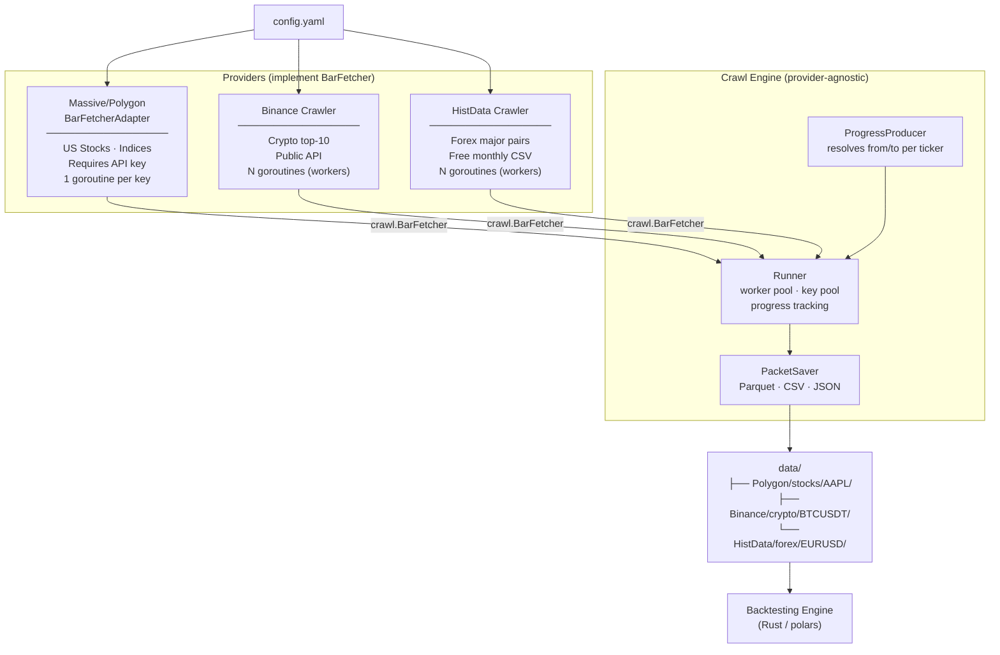

# hist-data

A multi-provider historical market data crawler. Fetches OHLCV bars from multiple sources and saves them as Parquet, CSV, or JSON for use in backtesting.

## Providers

| Provider              | Asset class                    | Auth             | Min granularity | Output dir       |
| --------------------- | ------------------------------ | ---------------- | --------------- | ---------------- |
| **Massive / Polygon** | Stocks, Indices, Crypto, Forex | API key required | 1-minute        | `data/Polygon/`  |
| **Binance**           | Crypto                         | None (public)    | 1-minute        | `data/Binance/`  |
| **HistData**          | Forex                          | None (free CSV)  | 1-minute        | `data/HistData/` |

> **No tick data** — minimum bar size is 1-minute across all providers.

---

## Worker sizing

Too many workers wastes memory; too few is slow. Here's what each worker costs at peak:

| Provider     | What one worker holds in RAM            | Recommended                    |
| ------------ | --------------------------------------- | ------------------------------ |
| **Massive**  | ~17 MB (5-min bars, 2y per ticker)      | 1–3 keys (rate-limited anyway) |
| **Binance**  | ~17 MB (5-min bars, 2y per ticker)      | 3–5 home · 5–10 VPS            |
| **HistData** | ~3.5 MB (1-min bars, 1 month at a time) | 2–3 home · 3–5 VPS             |

### Memory estimates

```
Bar struct = 64 bytes (8 fields × 8 bytes)

Binance 5-min bars, 2 years:
  252 trading days/yr × 2 yr × 24h × 12 bars/h = ~145 000 bars × 64 B ≈ 9 MB/ticker
  + 2× headroom for chunking buffers              ≈ 17–20 MB peak per worker

HistData 1-min bars, 1 month:
  30 days × 24h × 60 min = 43 200 bars × 64 B ≈ 2.8 MB + zip buffer ≈ 5 MB peak per worker

Massive 5-min bars, 2 years:
  Similar to Binance                              ≈ 17–20 MB peak per worker
```

### Rule of thumb

```
max_workers = available_RAM_for_crawl / peak_MB_per_worker

Example — 4 GB RAM, 2 GB reserved for OS/other:
  Binance:  2000 MB / 18 MB ≈ 100   ← but Binance rate-limits at ~1200 req/min, so cap at ~10
  HistData: 2000 MB / 5  MB ≈ 400   ← HistData server throttles, cap at ~5
```

> Binance rate limit: **1200 weight/min** per IP. Each klines request uses 2 weight → ~600 req/min.
> With 1000-bar chunks, `workers=5` fetches ~3000 chunks/min → well within limits.
> `workers > 10` risks 429s and automatic IP bans.

---

## Architecture



### DIP boundary

`crawl.Runner` depends only on the `crawl.BarFetcher` interface — it never imports a concrete provider.

```
crawl/interfaces.go  defines BarFetcher
provider/binance/    implements it directly
provider/histdata/   implements it directly
provider/polygon/    implements via BarFetcherAdapter (legacy method name)
```

### Concurrency model

```
ProgressProducer goroutine
  reads .lastday.json once → resolves from/to per target → chan <- Job

Worker goroutines
  Polygon:  1 goroutine per API key (key = auth + rate-limit slot)
  Binance:  N goroutines (binance.workers in config, no key needed)
  HistData: N goroutines (histdata.workers in config, no key needed)

  Each worker:  receive Job → FetchBars → SaveBars → write progress

Log writer goroutine   → drains log channel → slog (ordered output)
Result collector       → aggregates JobResult → run report
Progress writer        → drains ProgressUpdate → .lastday.json
```

---

## Quick start

```bash
cp .env.example .env
# For Polygon/Massive assets: set POLYGON_API_KEYS=key1,key2
# Binance and HistData need no credentials

go run ./cmd/us-data/
```

### Docker

```bash
cp .env.example .env
docker compose up --build -d
docker compose logs -f
```

---

## Configuration

All settings in `config.yaml`. Secrets via env — never commit API keys.

| Env var            | Description                                                   |
| ------------------ | ------------------------------------------------------------- |
| `POLYGON_API_KEYS` | Comma-separated keys for Massive/Polygon. One worker per key. |
| `POLYGON_API_KEY`  | Alternative single-key form.                                  |
| `LOG_LEVEL`        | `debug` / `info` / `warn` / `error`                           |
| `DATA_DIR`         | Override root data directory                                  |
| `SAVE_FORMAT`      | `parquet` / `csv` / `json`                                    |

### Key config sections

```yaml
# ── Massive/Polygon (API key required) ───────────────────────────────────
api:
  keys: []  # set via POLYGON_API_KEYS env  →  1 worker per key

# ── Binance (no key, crypto 1m+) ─────────────────────────────────────────
binance:
  interval: "5m"      # 1m | 5m | 15m | 1h | 4h | 1d
  workers: 3          # parallel goroutines

# ── HistData (no key, forex 1m only) ─────────────────────────────────────
histdata:
  workers: 2          # parallel goroutines

# ── Assets ───────────────────────────────────────────────────────────────
assets:
  - class: stocks
    provider: massive  # massive | binance | histdata
    enabled: true
    groups: [sp500, nasdaq100]

  - class: crypto
    provider: binance
    enabled: true
    tickers: [BTCUSDT, ETHUSDT, BNBUSDT, SOLUSDT, XRPUSDT,
              ADAUSDT, AVAXUSDT, DOTUSDT, LINKUSDT, MATICUSDT]

  - class: forex
    provider: histdata
    enabled: true
    tickers: [EURUSD, GBPUSD, USDJPY, AUDUSD, USDCHF]
```

### Polygon asset groups

| Group         | Source                | Plan     |
| ------------- | --------------------- | -------- |
| `sp500`       | GitHub CSV            | Free     |
| `nasdaq100`   | Wikipedia             | Free     |
| `dji`         | Wikipedia             | Free     |
| `russell2000` | Polygon ETF API       | Starter+ |
| `all`         | Polygon reference API | Starter+ |

---

## Output layout

```
data/
├── Polygon/
│   └── stocks/AAPL/
│       └── AAPL_5min_2024-01-01_to_2026-01-01.parquet
├── Binance/
│   └── crypto/BTCUSDT/
│       └── BTCUSDT_5m_2024-01-01_to_2026-01-01.parquet
├── HistData/
│   └── forex/EURUSD/
│       └── EURUSD_1m_2024-01-01_to_2026-01-01.parquet
├── .lastday.json          # progress: provider:class:TICKER → last fetched date
├── .lastrun.success.json
└── .lastrun.failed.json
```

---

## Internal package layout

```
cmd/us-data/
  main.go          entry point · wires providers and runs scheduler

internal/
  app/
    config.go      Config struct · LoadConfig (Viper) · InitLogger
    di.go          ProvideProviders: instantiates all needed BarFetchers
    bootstrap.go   ResolveTargetsByProvider: routes assets to providers
    app.go         Run: scheduler loop + multi-provider runner

  crawl/
    interfaces.go  BarFetcher interface (DIP boundary)
    types.go       Job · JobResult · LogEntry · AssetClass
    producer.go    ProgressProducer: resolves from/to per target
    runner.go      Runner: worker pool · key pool · heartbeat
    progress.go    .lastday.json read/write
    report.go      .lastrun.*.json

  provider/
    polygon/
      adapter.go   BarFetcherAdapter (bridges CrawlBarsWithKey → FetchBars)
      crawler.go   CrawlBarsWithKey: chunked Polygon API fetch
      indices.go   ResolveAssetTickers: sp500/nasdaq100/dji/etc.
    binance/
      client.go    GetKlines: public REST API, no key
      crawler.go   FetchBars + SaveBars (implements BarFetcher directly)
    histdata/
      client.go    GetBars: download + unzip + parse monthly CSV
      crawler.go   FetchBars + SaveBars (implements BarFetcher directly)

  model/  bar.go      Bar struct (OHLCV + VWAP + Transactions)
  saver/  *.go        PacketSaver: Parquet · CSV · JSON
```

---

## Testing

```bash
# Unit tests (no network)
go test ./internal/provider/binance/...   # 7 tests
go test ./internal/provider/histdata/...  # 9 tests

# Benchmark (Polygon worker concurrency)
go test -bench=BenchmarkChanFlowQuick ./internal/provider/polygon/...

# Race detector
go test -race ./...

# Full build check
go build ./... && go vet $(go list ./... | grep -v polygon)
```

---

## Debug

```bash
LOG_LEVEL=debug go run ./cmd/us-data/
go run -race ./cmd/us-data/
```

See [docs/DEBUG.md](docs/DEBUG.md) for Docker debug commands.

---

## License

MIT
