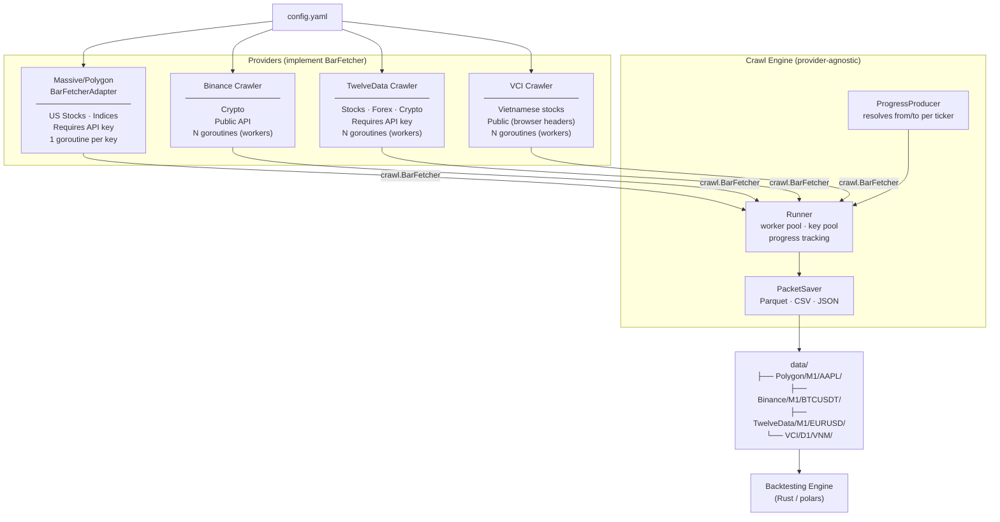

# hist-data

A multi-provider historical market data crawler. Fetches OHLCV bars from Polygon, Binance, TwelveData, and VCI; saves them as Parquet, CSV, or JSON for use in backtesting.

## Providers

| Provider              | Asset class                       | Auth             | Min granularity | Output dir         |
| --------------------- | --------------------------------- | ---------------- | --------------- | ------------------ |
| **Massive / Polygon** | US Stocks, Indices, Crypto, Forex | API key required | 1-minute        | `data/Polygon/`    |
| **Binance**           | Crypto                            | None (public)    | 1-minute        | `data/Binance/`    |
| **TwelveData**        | Stocks, Forex, Crypto             | API key required | 1-minute        | `data/TwelveData/` |
| **VCI (Vietcap)**     | Vietnamese stocks                 | None (public)    | 1-minute        | `data/VCI/`        |

> **No tick data** — minimum bar size is 1-minute across all providers.

---

## Worker sizing

Too many workers wastes memory; too few is slow. Here's what each worker costs at peak:

| Provider      | What one worker holds in RAM       | Recommended                         |
| ------------- | ---------------------------------- | ----------------------------------- |
| **Polygon**   | ~17 MB (5-min bars, 2y per ticker) | 1–3 keys (rate-limited per key)     |
| **Binance**   | ~17 MB (5-min bars, 2y per ticker) | 3–5 home · 5–10 VPS                 |
| **TwelveData**| ~17 MB (5-min bars, 2y per ticker) | 1–3 keys (rate-limited per key)     |
| **VCI**       | ~17 MB (1-min bars, 2y per ticker) | 2–4 (no key, browser-header access) |

### Memory estimates

```
Bar struct = 64 bytes (8 fields × 8 bytes)

Binance 5-min bars, 2 years:
  252 trading days/yr × 2 yr × 24h × 12 bars/h = ~145 000 bars × 64 B ≈ 9 MB/ticker
  + 2× headroom for chunking buffers              ≈ 17–20 MB peak per worker

Polygon 5-min bars, 2 years:
  Similar to Binance                              ≈ 17–20 MB peak per worker
```

### Rule of thumb

```
max_workers = available_RAM_for_crawl / peak_MB_per_worker

Example — 4 GB RAM, 2 GB reserved for OS/other:
  Binance:    2000 MB / 18 MB ≈ 100   ← Binance rate-limits at ~1200 req/min, cap at ~10
  TwelveData: rate-limited by API plan, cap workers to key count
```

> Binance rate limit: **1200 weight/min** per IP. Each klines request uses 2 weight → ~600 req/min.
> With 1000-bar chunks, `workers=5` is well within limits. `workers > 10` risks 429s and IP bans.

---

## Architecture



### DIP boundary

`crawl.Runner` depends only on the `crawl.BarFetcher` interface — it never imports a concrete provider.

```
crawl/interfaces.go   defines BarFetcher
provider/binance/     implements it directly
provider/twelvedata/  implements it directly
provider/vci/         implements it directly
provider/polygon/     implements via BarFetcherAdapter (legacy method name)
```

### Concurrency model

```
ProgressProducer goroutine
  reads .lastday.json once → resolves from/to per target → chan <- Job

Worker goroutines
  Polygon:     1 goroutine per API key (key = auth + rate-limit slot)
  Binance:     N goroutines (binance.workers in config, no key needed)
  TwelveData:  N goroutines (twelvedata.workers in config)
  VCI:         N goroutines (vci.workers in config, no key needed)

  Each worker:  receive Job → FetchBars → SaveBars → write progress

Log writer goroutine   → drains log channel → slog (ordered output)
Result collector       → aggregates JobResult → run report
Progress writer        → drains ProgressUpdate → .lastday.json
```

---

## Quick start

```bash
cp .env.example .env
# Polygon/Massive assets:  set POLYGON_API_KEYS=key1,key2
# TwelveData assets:       set TWELVEDATA_API_KEY=your_key
# Binance and VCI need no credentials

go run ./cmd/hist-data/
```

### Docker

```bash
cp .env.example .env
docker compose up --build -d
docker compose logs -f
```

---

## Configuration

All settings in `config.yaml`. Secrets via env — never commit API keys.

| Env var              | Description                                                   |
| -------------------- | ------------------------------------------------------------- |
| `POLYGON_API_KEYS`   | Comma-separated keys for Massive/Polygon. One worker per key. |
| `POLYGON_API_KEY`    | Alternative single-key form.                                  |
| `TWELVEDATA_API_KEY` | API key for TwelveData.                                       |
| `LOG_LEVEL`          | `debug` / `info` / `warn` / `error`                           |
| `DATA_DIR`           | Override root data directory                                  |
| `SAVE_FORMAT`        | `parquet` / `csv` / `json`                                    |

### Key config sections

```yaml
# ── Massive/Polygon (API key required) ───────────────────────────────────
massive:
  workers: 3
  schedule:
    runHour: 18      # UTC hour to trigger daily run
    runMinute: 0

# ── Binance (no key, crypto) ──────────────────────────────────────────────
binance:
  workers: 3

# ── TwelveData (API key required) ────────────────────────────────────────
twelvedata:
  workers: 2

# ── VCI / Vietcap (no key, Vietnamese stocks) ────────────────────────────
vci:
  workers: 2

# ── Assets ───────────────────────────────────────────────────────────────
assets:
  - class: stocks
    provider: massive
    backfillYears: 2
    frames:
      - name: M1
    sinkFrames: [M1, M5, M15, M30, H1, H4]
    enabled: true
    groups: [sp500, nasdaq100]

  - class: crypto
    provider: binance
    backfillYears: 4
    frames:
      - name: M1
      - name: D1
        backfillYears: 7
    sinkFrames: [M1, M5, M15, M30, H1, H4]
    enabled: true
    tickers: [BTCUSDT, ETHUSDT, BNBUSDT, SOLUSDT, XRPUSDT]

  - class: forex
    provider: twelvedata
    backfillYears: 10
    frames:
      - name: M1
    sinkFrames: [M1, M5, M15, M30, H1, H4]
    enabled: true
    tickers: [EUR/USD, GBP/USD, USD/JPY]

  - class: vn
    provider: vci
    backfillYears: 3
    frames:
      - name: M1
      - name: D1
        backfillYears: 25
    sinkFrames: [M1, M5, M15, M30, H1, H4]
    enabled: true
    groups: [vn30]
```

### Frame model

Use `frames` on each asset entry. Every frame expands into a separate runtime pipeline key:

```yaml
frames:
  - name: M1
    backfillYears: 3
  - name: D1
    backfillYears: 25
```

`backfillYears` is required at the data type level. Each frame may override it when needed.

If source frame is `M1`, you can optionally add `sinkFrames` so the writer saves derived intraday bars in one pass:

```yaml
sinkFrames: [M1, M5, M15, M30, H1, H4]
```

Supported frame names: `M1`, `M5`, `M15`, `M30`, `H1`, `H4`, `D1`, `W1`, `MO1`.

### Provider frame support

| Provider | Supported frames |
| -------- | ---------------- |
| `massive` | `M1`, `M5`, `M15`, `M30`, `H1`, `H4`, `D1`, `W1`, `MO1` |
| `binance` | `M1`, `M5`, `M15`, `M30`, `H1`, `H4`, `D1`, `W1`, `MO1` |
| `twelvedata` | `M1`, `M5`, `M15`, `M30`, `H1`, `H4`, `D1`, `W1`, `MO1` |
| `vci` | `M1`, `H1`, `D1` |

Legacy fields `timespan`, `interval`, and `timeFrame` are still accepted during migration, but new config should use `frames`.

### Polygon asset groups

| Group         | Source                | Plan     |
| ------------- | --------------------- | -------- |
| `sp500`       | GitHub CSV            | Free     |
| `nasdaq100`   | Wikipedia             | Free     |
| `dji`         | Wikipedia             | Free     |
| `russell2000` | Polygon ETF API       | Starter+ |
| `all`         | Polygon reference API | Starter+ |

### VCI asset groups

| Group   | Description                    |
| ------- | ------------------------------ |
| `vn30`  | VN30 index constituents        |
| `hose`  | All HOSE-listed stocks         |
| `hnx`   | All HNX-listed stocks          |

> VCI native timeframes map from unified frames: `M1` → `ONE_MINUTE`, `H1` → `ONE_HOUR`, `D1` → `ONE_DAY`.
> Minute data depth is roughly 2.5 years.

---

## Output layout

```
data/
├── Polygon/
│   └── M1/AAPL/
│       └── AAPL_5min_2024-01-01_to_2026-01-01.parquet
├── Binance/
│   └── M1/BTCUSDT/
│       └── BTCUSDT_5m_2024-01-01_to_2026-01-01.parquet
├── TwelveData/
│   └── M1/EURUSD/
│       └── EURUSD_5min_2024-01-01_to_2026-01-01.parquet
├── VCI/
│   └── D1/VNM/
│       └── VNM_1min_2024-01-01_to_2026-01-01.parquet
├── .lastday.json          # progress: provider:class:frame:TICKER → last fetched date
├── .lastrun.success.json
└── .lastrun.failed.json
```

---

## Internal package layout

```
cmd/hist-data/
  main.go          entry point · wires providers and runs scheduler

internal/
  app/
    config.go      Config struct · LoadConfig (Viper) · InitLogger
    di.go          buildProviders: instantiates all BarFetchers · buildPacketSaver
    bootstrap.go   ResolveTargetsByProvider: routes assets → providers · ticker resolution
    app.go         Run: per-provider scheduler loops

  crawl/
    interfaces.go  BarFetcher interface (DIP boundary)
    types.go       Job · JobResult · LogEntry · AssetClass
    producer.go    ProgressProducer: resolves from/to per target
    runner.go      Runner: worker pool · key pool · heartbeat (15 min)
    progress.go    .lastday.json read/write
    report.go      .lastrun.*.json

  provider/
    polygon/
      adapter.go   BarFetcherAdapter (bridges CrawlBarsWithKey → FetchBars)
      crawler.go   CrawlBarsWithKey: chunked Polygon API fetch
      indices.go   ResolveAssetTickers: sp500/nasdaq100/dji/russell2000/all
    binance/
      client.go    GetKlines: public REST API, no key
      crawler.go   FetchBars + SaveBars (implements BarFetcher directly)
    twelvedata/
      client.go    GetBars: TwelveData REST API
      crawler.go   FetchBars + SaveBars (implements BarFetcher directly)
    vci/
      client.go    GetOHLC: Vietcap REST API (browser headers)
      listing.go   GetAllSymbols · GetSymbolsByGroup
      crawler.go   FetchBars + SaveBars (implements BarFetcher directly)

  model/  bar.go      Bar struct (t, o, h, l, c, v, vw, n)
  saver/  *.go        PacketSaver: Parquet · CSV · JSON
```

---

## Testing

```bash
# Unit tests (no network)
go test ./internal/provider/binance/...
go test ./internal/provider/twelvedata/...

# Benchmark (Polygon worker concurrency)
go test -bench=BenchmarkChanFlowQuick ./internal/provider/polygon/...

# Race detector
go test -race ./...

# Full build check
go build ./... && go vet ./...
```

---

## Debug

```bash
LOG_LEVEL=debug go run ./cmd/hist-data/
go run -race ./cmd/hist-data/
```

See [docs/DEBUG.md](docs/DEBUG.md) for Docker debug commands and GODEBUG flags.

---

## License

MIT
